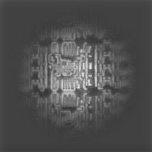
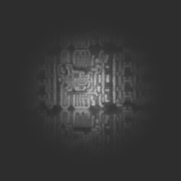
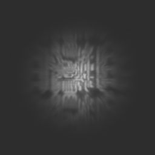

# Optical Image Approximation with Shrinking & Distortion Effects

This project demonstrates a workflow to create an **optical image approximation** using two main image processing steps: **vignetting shrink** and **distortion**.  

The goal is to simulate optical effects that modify the patterns in an image. This can be useful in optical research, photography simulation, or artistic image processing.

---

## Effects Overview

1. **Vignetting Shrink**  
   The first script applies a vignette effect to minimize the central pattern of the image while blending it into a dark background.  
   - **`shrink_intensity`** controls how much the pattern is minimized.  
   - **`darkness`** controls the gradient of the fade toward the background.  

2. **Distortion Effect**  
   The second script applies a distortion using polar coordinates (`angle` and `radius`) and adaptive Gaussian filtering. This simulates optical distortions commonly seen in lenses.

---

## Input & Output Images

| Stage | Image |
|-------|-------|
| Input Image |  |
| After Vignetting Shrink |  |
| After Distortion |  |

---

## Running the Scripts

### Requirements

- Python 3.x
- OpenCV (`cv2`)  
- NumPy (`numpy`)  
- DIPlib (`diplib`)

Install dependencies via pip:

```bash
pip install opencv-python-headless numpy diplib
```

## Step 1: Vignetting Shrink

Run the first script to apply the vignette shrink effect:

```bash
python vignette_shrink.py
```

This will:

* Read Picture1.jpg

* Apply a vignetting shrink effect

* Save the output as vignette_shrunk.jpg

**Parameters you can adjust:**

* shrink_intensity (0.1–1.5) — higher values hide more pattern

* darkness — higher values create a faster transition to the dark background

**Step 2: Distortion Effect**

Run the second script to apply the distortion effect:
```
python distortion_effect.py
```

This will:

* Read vignette_shrunk.jpg

* Apply a distortion using angle and radius coordinates with adaptive Gaussian filtering

* Save the output as OutputImage.jpg

**Parameters you can adjust:**

* angle and scale — control how the distortion is applied

* [1,5] — controls the strength of the adaptive Gaussian filter

## References & Inspiration

This workflow is inspired by optical image simulation techniques and uses the following repositories:

**DIPlib**
 – For distortion and image processing operations.

**Custom OpenCV scripts**
 – For vignetting and pattern shrink effects.

These scripts aim to approximate optical transformations and distortions in digital images.
